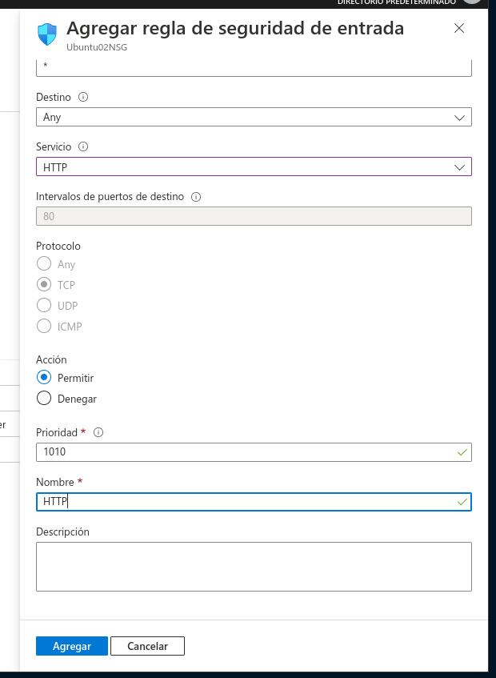

# Azure 🔷 IaaS

Microsoft Azure es un sercicio que nos permite desplegar nuestros proyectos eligiendo entre diferentes herramientas con mayor o menos flexibilidad dependiendo de los requerimientos de nuestras aplicaciones.

* IaaS (Infraestructura as a Service): Nos permite controlar totalmente la infraestructura trabajando con máquinas virtuales, balanceadores de carga, VPNs para construir soluciones en la nube.

* PaaS (Platform as as Service): Nos permite enfocarnos únicamente en el desarrollo de nuestra aplicación (sitios web, BBDD, almacenamiento), dejando que Azure se encargue de la infraestructura por nosotros.

## Instalación y configuración a Azure CLI

Para poder instalar Azure Cli en cualquira de las distribuciones Linux, deberemos de ejecutar el siguiente comando:

```bash
curl -L https://aka.ms/InstallAzureCli | bash
```

Para iniciar sesión con nuestra cuenta de Azure, deberemos de ejecutar:

```bash
az login
```

## Creación de una VM

En primer lugar, debemos de elegir una de las miles de imágenes que hay disponibles en dicho portal.

```bash
az vm image list
```

Para crear una máquina a través de línea de comandos, usarmos el siguiente comando:

```bash
az v, create -n <vm-name> -g <resourcegroup-name> --image <image-name> --authentication-type <auth-type> --admin-username <adminusername> --location <geographic-location>

az vm create -n Ubuntu02 -g plaztiIaaS --image UbuntuLTS --authentication-type password --admin-username amartinper --location westus3

# Se usará la opción --generate-ssh-keys para generar claves públicas y privadas.
```

Para conectarnos a esta máquina virtual usaremos ssh:

```bash
ssh <user>@<public-ip>
```

En este caso instalaremos un servidor Apache:

```bash
sudo apt update
sudo apt install apache2 -y
```

## Reglas de firewall

Para poder acceder a un servicio de una máquina virtual a través de la IP pública necesitamos abrir los puertos del firewall, por defecto deniega todos los puertos.

Para hacerlo a través del Portal de Azure, dentro de nuestra máquina virtual, dirigirnos al apartado de **Redes** > **Agragar una regla de puerto de entrada** y configurarlo de la siguiente manera:



## Scripts de automatización

Para poder automatizar la creación de máquinas virtuales idénticas, deberemos de crear un fichero como el siguiente.

```json
{
    "name": "config-app", // Nombre
    "type": "Extensions", // Tipo de extensiones 
    "location": "[resourceGroup().location]", // Especifica la ubicación del grupo de recursos
    "apiVersion": "2019-03-01",
    "dependsOn": [ 
      "[concat('Microsoft.Compute/virtualMachines/', concat(variables('vmName'),copyindex()))]"
    ],
    "tags": { // Tags que requiere la aplicación
      "displayName": "config-app"
    },
    "properties": { // Parámetros
      "publisher": "Microsoft.Azure.Extensions",
      "type": "CustomScript",
      "typeHandlerVersion": "2.1",
      "autoUpgradeMinorVersion": true,
      "settings": {
        "skipDos2Unix":false,
        "timestamp":123456789          
      },
      "protectedSettings": { // Configuraciones protegidas
         "commandToExecute": "<command-to-execute>", // Ejectura un comando concreto
         "script": "<base64-script-to-execute>", // Si tenemos un Script dentro de Azure, lo podemos llamar de manera directa
         "storageAccountName": "<storage-account-name>",
         "storageAccountKey": "<storage-account-key>",
         "fileUris": ["https://.."], // Si creamos una cuenta de almacenamiento dentro de Azure, y en esta cuenta tenemos una cuenta privada la podemos tener en este apartado.
         "managedIdentity" : "<managed-identity-identifier>" 
      }
    }
  }

// Source: https://docs.microsoft.com/en-us/azure/virtual-machines/extensions/custom-script-linux
```

## Balanceador de carga

Un balanceador de carga es un dispositivo de Hardware o Software que se pone al frente de un conjunto de servidores que alojan una aplicación y asigna o balancea las solicitudes que llegan a los servidores usando agluno de los algoritmos existente. Por ej. Round Robin.

## Redimensión de VMs

Para poder redimensionar una VM, a través del Portal de Azure, primeramente deberemos entrar en dicha mäquina virtual. Seguidamente, en el apartado **Tamaño** podremos elegir el tamaño de dicha máquina virtual dentro de un abanico de soluciones.

## Redes virtuales

Una red virtual la posibilidad de comunicarse entre diferentes ordenadores, máquinas virtuales, servidores virtuales y otros dispositivos ubicados en distintos centros de datos y oficinas. Consisten que los dispositivos de distintas ubicaciones funcionen con las mismas prestaciones que si estuvieran conectados mediante redes físicas tradicionales y permite que la red abarque diferentes ubicaciones fisicas.

## Creación del proyecto

En este caso, tendremos un proyecto con tres máquinas virtuales de Azure, donde se balancearán la carga si una de estas falla.

Para comenzar, deberemos de crear un grupo de recursos en la ubicación elegida y generar una IP pública:

```bash
# Create Resource Group
az group create --name platziBalancer --location eastus

# Create Public IP for the load balancer
az network public-ip create --resource-group platziBalancer --name myPublicIP
```

A continuación crearemos el balanceador de carga, donde también hará la prueba de monitoreo en el puerto 80, ya que será una página web:

```bash
# Create Load Balancer
az network lb create -g platziBalancer --name myLoadBalancer --frontend-ip-name myFrontEndPool --backend-pool-name myBackendPool --public-ip-address myPublicIP

# Monitoring test
az network lb probe create -g platziBalancer --lb-name myLoadBalancer --name myHealthProbe --protocol tcp --port 80

# Create a rule for the monitoring test
az network lb rule create -g platziBalancer --lb-name myLoadBalancer --name myLoadBalancerRule --protocol Tcp --frontend-port 80 --backend-port 80 --frontend-ip-name myFrontEndPool --backend-pool-name myBackendPool --probe-name myHealthProbe

```

Seguidamente, crearemos una red virtual con sus reglas de entrada y salida:

```bash
# Create an vnet (Virtual Netwrork)
az network vnet create -g platziBalancer -n myVnet --subnet-name mySubnet

# Create an NSG (Network Security Group)
az network nsg create -g platziBalancer -n myNSG

# Create an I/O rule for the NSG
az network nsg rule create -g platziBalancer --nsg-name myNSG --name myNSGR --priority 1001 --protocol tcp --destination-port-range 80
```

Para acabar, crearemos las interfaces de red para las VMs y las própias VMs.

```bash
# Create 3 NICs
for i in `seq 1 3`; do
az network nic create -g platziBalancer --name myNic$i --vnet-name myVnet --subnet mySubnet --network-security-group myNSG --lb-name myLoadBalancer --lb-address-pools myBackendPool
done

# Set an Availavility zone for the Load Balancer
az vm availability-set create -g platziBalancer --name myAvailabilitySet

# Create 3 VMs assignin their NICs
for i in `seq 1 3`; do
az vm create -g platziBalancer --name myVM$i --availability-set myAvailabilitySet --nics myNic$i --image UbuntuLTS --admin-username azureuser --generate-ssh-key --custom-data cloud-init.txt --no-wait
done
```
